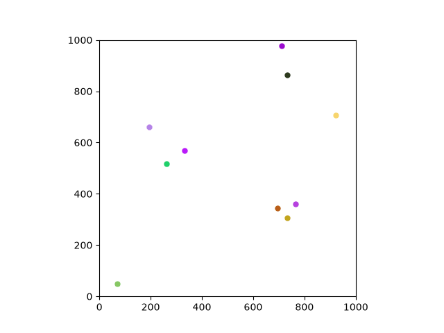
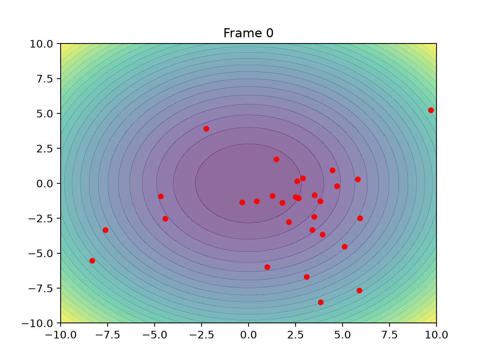
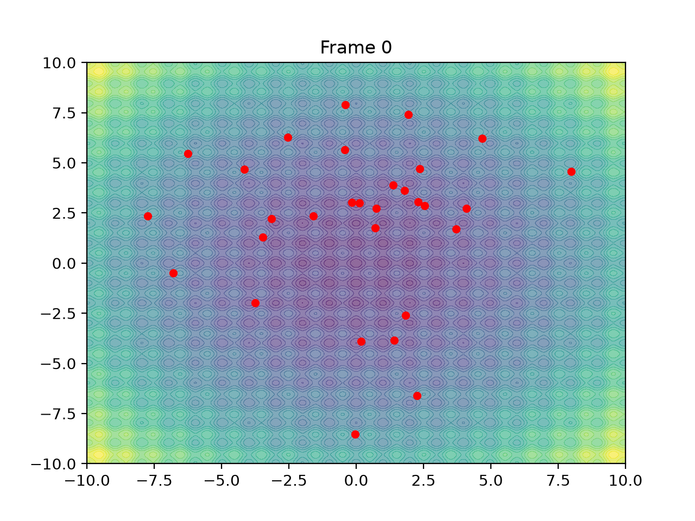
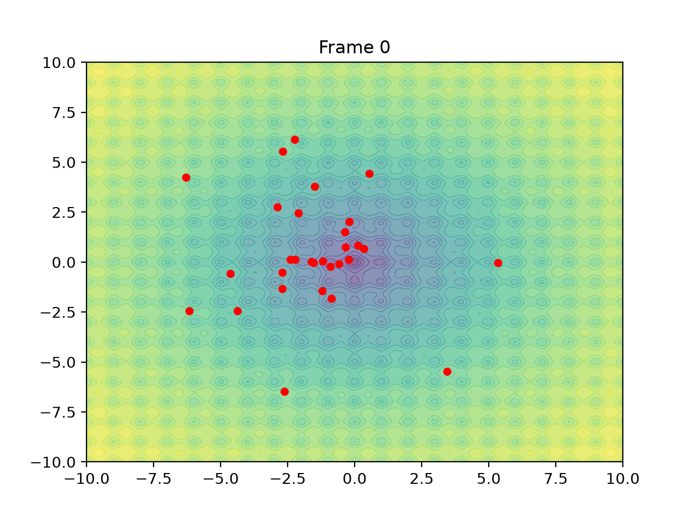
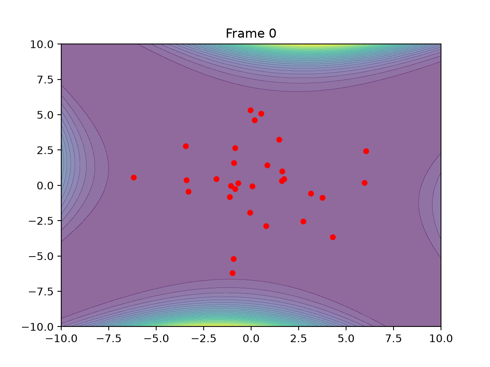
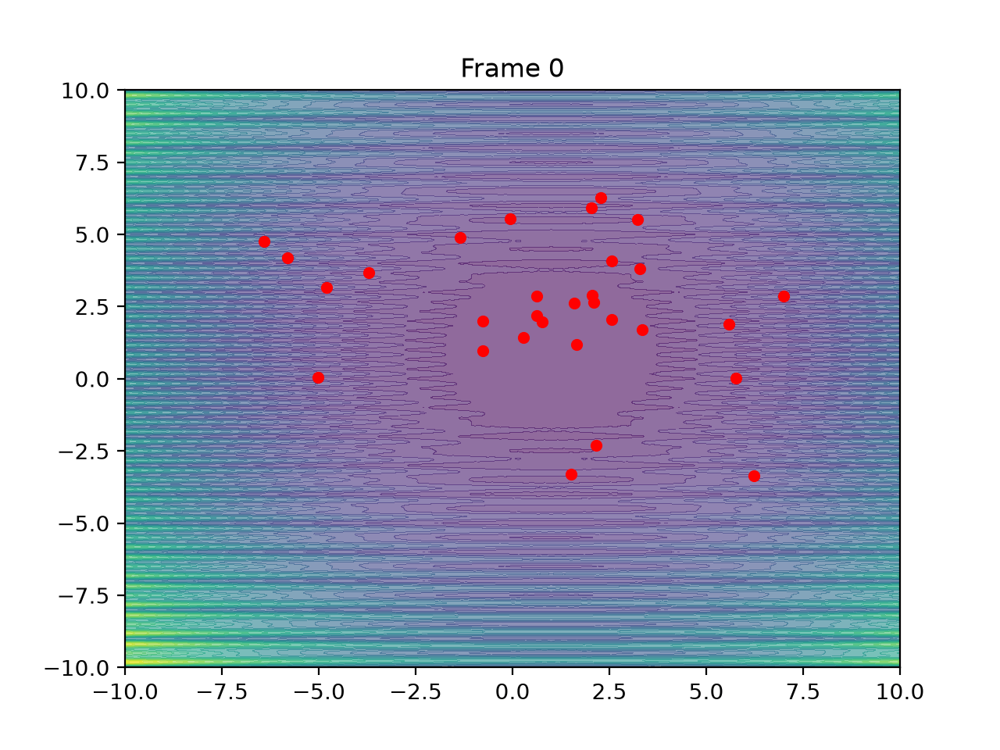

# Animals in Motion

This is practice code to learn `matplotlib` animations, especially moving particles, and soon will extend this to random walks and simulations of SDE based animal movement and interactions.

## Animations

### Swarm Optimization

The project also includes simple visualizations of Particle Swarm Optimization (PSO). The particles move through an objective-function landscape while collectively searching for an optimal solution.

Sphere — Simple convex function used to visualize basic PSO convergence.
Rastrigin — Highly multimodal function with many local minima.
Ackley — Multimodal function with a broad landscape and a global minimum.
Goldstein–Price — A more complex two-dimensional function with several local structures.
Levy — Multimodal function with multiple local minima and a global optimum.

***

## Next Steps

* Random walks
* Multiple interacting particles
* Stochastic differential equations (SDEs)
* Animal movement models
* Animal–animal interactions
* Ecological simulations under stochastic environments

